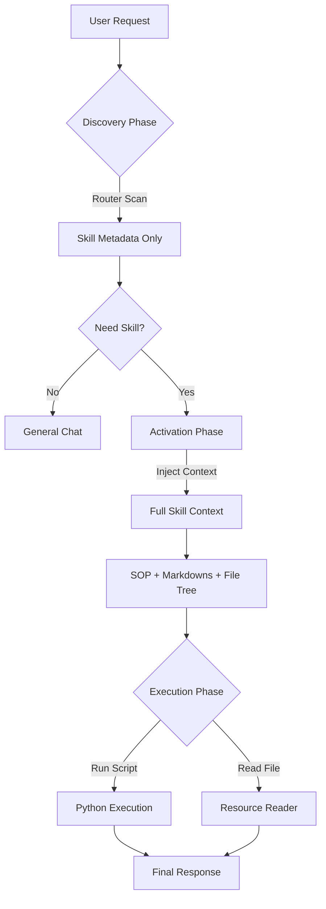

这是一个为您量身定制的 `README.md`。它不仅涵盖了工程的安装和运行，还重点阐述了我们刚刚实现的核心架构理念（如“渐进式披露”和“地图与探索”模式），显得非常专业。

你可以直接将以下内容保存为项目根目录下的 `README.md`。

---

# Gemini Agent Skills Framework 🚀

这是一个基于 Google Gemini 模型的轻量级智能体运行时框架。它旨在完全兼容 [Anthropic Claude Skills](https://github.com/anthropics/skills) 标准，允许开发者在 Gemini 生态中运行为 Claude 设计的技能包。

本项目采用 **渐进式披露 (Progressive Disclosure)** 和 **地图与探索 (Map & Explore)** 架构，实现了高效的上下文管理和对复杂目录结构的自适应支持。

---

## ✨ 核心特性

* **完全兼容 Claude Skills 标准**：支持 `SKILL.md`、`reference/`、`forms/` 等标准目录结构。
* **渐进式披露架构 (Progressive Disclosure)**：
* **Discovery**: 仅加载元数据进行路由，极低 Token 消耗。
* **Activation**: 动态加载 SOP 和知识库。
* **Execution**: 按需调用工具脚本。


* **自适应“地图与探索”模式**：
* 自动生成文件树（File Tree），让模型感知自定义目录（如 `ooxml/`）。
* 提供 `read_resource` 工具，允许模型按需读取任意非 Markdown 文件。


* **通用工具桥接**：无需为每个脚本编写工具定义，框架自动扫描并挂载 Python 脚本。
* **现代化工程管理**：使用 `uv` 进行极速的依赖管理和环境隔离。

---

## 🏗️ 架构原理

本框架将 Agent 的生命周期划分为三个阶段，以平衡 Token 成本与任务复杂度：



1. **Map (制图)**: 在激活阶段，框架会扫描技能目录，自动聚合所有的 Markdown 文档，并绘制一张完整的“文件树地图”注入 Prompt。
2. **Explore (探索)**: 对于地图中存在的未知资源（如 XML、JSON 配置），模型可以使用 `read_resource` 工具主动获取内容。

---

## 🛠️ 快速开始

### 前置要求

* Python 3.10+
* [uv](https://github.com/astral-sh/uv) (推荐) 或 pip
* Google Gemini API Key

### 1. 安装与初始化

```bash
# 克隆项目 (假设你已经初始化了git)
git clone <your-repo-url>
cd gemini-agent-framework

# 使用 uv 同步环境 (会自动创建虚拟环境并安装依赖)
uv sync

# 或者手动安装
uv venv
source .venv/bin/activate
uv add google-generativeai python-dotenv pyyaml rich

```

### 2. 配置环境变量

在项目根目录创建 `.env` 文件：

```env
GOOGLE_API_KEY=你的_Gemini_API_Key

```

### 3. 创建你的第一个技能

在 `skills/` 目录下创建一个技能包，例如 `skills/data-analyst/`。

**目录结构示例：**

```text
skills/data-analyst/
├── SKILL.md             <-- [必须] 核心定义与 SOP
├── reference/           <-- [可选] 知识库
│   └── sql_guide.md
├── scripts/             <-- [可选] Python 工具脚本
│   └── analyze.py
└── custom_data/         <-- [可选] 任意自定义目录
    └── config.json

```

**SKILL.md 内容示例：**

```markdown
---
name: data_analyst
description: 数据分析专家，可以处理 CSV 文件并生成图表。
---
# Data Analyst SOP
1. 当用户上传数据时，使用 `analyze.py` 进行处理。
2. 遇到配置问题，请查阅 `custom_data/` 下的文件。

```

### 4. 运行框架

```bash
uv run main.py

```

---

## 📖 使用指南

启动后，你将进入交互式命令行界面。

1. **自动路由**：直接输入需求，例如 `帮我分析一下这个报表`。框架会自动识别意图并加载 `data_analyst` 技能。
2. **查看状态**：输入 `status` 查看当前激活的技能。
3. **资源读取**：如果技能包里有非 Markdown 文件（例如 `config.json`），你可以直接问 Agent：“请读取 config.json 的内容”，Agent 会自动调用 `read_resource` 工具。
4. **退出**：输入 `exit` 或 `q`。

---

## 🛡️ 安全警告

> **⚠️ 注意**：本框架目前的实现使用了 `subprocess` 在本地环境中直接运行 `skills/*/scripts/` 下的 Python 代码。

* **仅运行受信任的技能包**：不要运行来源不明的 Skill，这等同于在你的电脑上执行任意代码。
* **生产环境建议**：在生产环境中使用，请务必修改 `execute_script` 函数，将代码执行层通过 API 转发到 **Docker 容器** 或 **安全沙箱 (e2b, Piston)** 中运行。

---

## 📂 项目结构

```text
.
├── .env                    # API Key 配置
├── .venv/                  # Python 虚拟环境
├── main.py                 # 框架主入口 (Orchestrator & Runtime)
├── pyproject.toml          # uv 依赖定义
├── uv.lock
└── skills/                 # 技能仓库
    ├── pdf-processor/      # [示例] PDF 处理技能
    └── pptx-skill/         # [示例] PPTX 处理技能 (包含复杂目录)

```

---

## 🤝 贡献与兼容性

本框架旨在兼容 [agentskills.io](https://agentskills.io) 规范。
目前的实现基于 `gemini-2.0-flash-exp` 模型进行了优化，利用其长上下文窗口来处理完整的文件树注入。

---

## License

MIT License