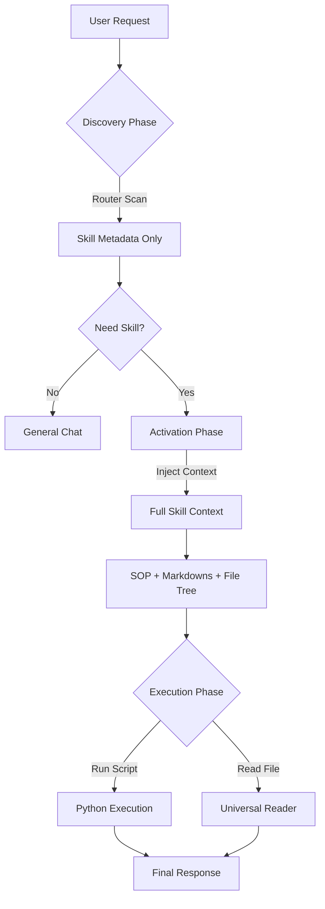

# Universal Agent Skills Framework 🚀

这是一个多后端兼容的轻量级智能体运行时框架。它旨在完全兼容 [Anthropic Claude Skills](https://github.com/anthropics/skills) 标准，允许开发者在不同 LLM 生态中运行为 Claude 设计的技能包。

本项目支持 **Google Gemini** 和 **DeepSeek** 双后端，采用 **渐进式披露 (Progressive Disclosure)** 和 **地图与探索 (Map & Explore)** 架构，实现了高效的上下文管理和对复杂目录结构的自适应支持。


---

## ✨ 核心特性

* **完全兼容 Claude Skills 标准**：支持 `SKILL.md`、`reference/`、`forms/` 等标准目录结构。
* **多后端支持**：
  * **Google Gemini**：原生支持工具调用，使用 `gemini-2.5-flash` 模型。
  * **DeepSeek**：通过 OpenAI 兼容 API 接入，支持工具调用。

* **渐进式披露架构 (Progressive Disclosure)**：
  * **Discovery**: 仅加载元数据进行路由，极低 Token 消耗。
  * **Activation**: 动态加载 SOP 和知识库。
  * **Execution**: 按需调用工具脚本。

* **自适应“地图与探索”模式**：
  * 自动生成文件树（File Tree），让模型感知自定义目录（如 `ooxml/`）。
  * 提供 `read_file` 工具（别名 `read_resource`），允许模型按需读取任意非 Markdown 文件。

* **通用文档解析器 (Universal Reader)**：
  * 支持 PDF、DOCX、PPTX、XLSX、CSV 等多种文档格式的自动解析。
  * 提供统一的 `read_file` 工具接口，智能选择解析器。

* **通用工具桥接**：无需为每个脚本编写工具定义，框架自动扫描并挂载 Python 脚本。
* **现代化工程管理**：使用 `uv` 进行极速的依赖管理和环境隔离。

---

## 🏗️ 架构原理

本框架将 Agent 的生命周期划分为三个阶段，以平衡 Token 成本与任务复杂度：



1. **多后端适配**：框架通过抽象基类 `LLMBackend` 支持不同的 LLM 提供商，当前实现了 Gemini 和 DeepSeek 两个后端。

2. **Map (制图)**: 在激活阶段，框架会扫描技能目录，自动聚合所有的 Markdown 文档，并绘制一张完整的“文件树地图”注入 Prompt。

3. **Explore (探索)**: 对于地图中存在的未知资源（如 XML、JSON 配置），模型可以使用 `read_file` 工具主动获取内容。

4. **Universal Reader**: 框架内置了通用文档解析器，支持多种文档格式的自动解析，无需为每种格式编写专门的工具。

---

## 🛠️ 快速开始

### 前置要求

* Python 3.10+
* [uv](https://github.com/astral-sh/uv) (推荐) 或 pip
* Google Gemini API Key（使用 Gemini 后端时）
* DeepSeek API Key（使用 DeepSeek 后端时）

### 1. 安装与初始化

```bash
# 克隆项目 (假设你已经初始化了git)
git clone <your-repo-url>
cd UniversalSkills

# 使用 uv 同步环境 (会自动创建虚拟环境并安装依赖)
uv sync

# 或者手动安装
uv venv
source .venv/bin/activate
uv add google-generativeai python-dotenv pyyaml rich openai

# 安装文档解析依赖
uv add pypdf python-docx python-pptx pandas openpyxl

```

### 2. 配置环境变量

在项目根目录创建 `.env` 文件：

**使用 Gemini 后端（默认）：**
```env
GOOGLE_API_KEY=你的_Gemini_API_Key

```

**使用 DeepSeek 后端：**
```env
LLM_PROVIDER=deepseek
DEEPSEEK_API_KEY=你的_DeepSeek_API_Key
DEEPSEEK_BASE_URL=https://api.deepseek.com/v1
DEEPSEEK_MODEL_NAME=deepseek-chat

```

### 3. 创建你的第一个技能

在 `skills/` 目录下创建一个技能包，例如 `skills/data-analyst/`。

**目录结构示例：**

```text
skills/data-analyst/
├── SKILL.md             <-- [必须] 核心定义与 SOP
├── reference/           <-- [可选] 知识库
│   └── sql_guide.md
├── scripts/             <-- [可选] Python 工具脚本
│   └── analyze.py
└── custom_data/         <-- [可选] 任意自定义目录
    └── config.json

```

**SKILL.md 内容示例：**

```markdown
---
name: data_analyst
description: 数据分析专家，可以处理 CSV 文件并生成图表。
---
# Data Analyst SOP
1. 当用户上传数据时，使用 `analyze.py` 进行处理。
2. 遇到配置问题，请查阅 `custom_data/` 下的文件。

```

### 4. 运行框架

```bash
uv run main.py

```

---

## 📖 使用指南

启动后，你将进入交互式命令行界面。

1. **自动路由**：直接输入需求，例如 `帮我分析一下这个报表`。框架会自动识别意图并加载 `data_analyst` 技能。
2. **文档解析**：直接请求解析文档，例如 `请解析并总结 docs/report.pdf`，Agent 会自动调用 `read_file` 工具进行解析。
3. **资源读取**：如果技能包里有非 Markdown 文件（例如 `config.json`），你可以直接问 Agent：“请读取 config.json 的内容”，Agent 会自动调用 `read_file` 工具。
4. **脚本执行**：如果技能包提供了脚本，例如 `analyze.py`，你可以请求执行：“请运行 analyze.py 分析数据”。
5. **退出**：输入 `exit` 或 `q`。

---

## 🛡️ 安全警告

> **⚠️ 注意**：本框架目前的实现使用了 `subprocess` 在本地环境中直接运行 `skills/*/scripts/` 下的 Python 代码。

* **仅运行受信任的技能包**：不要运行来源不明的 Skill，这等同于在你的电脑上执行任意代码。
* **生产环境建议**：在生产环境中使用，请务必修改 `execute_script` 函数，将代码执行层通过 API 转发到 **Docker 容器** 或 **安全沙箱 (e2b, Piston)** 中运行。

---

## 📂 项目结构

```text
.
├── .env                    # API Key 配置
├── .venv/                  # Python 虚拟环境
├── main.py                 # 框架主入口 (Orchestrator & Runtime)
├── pyproject.toml          # uv 依赖定义
├── uv.lock
├── docs/                   # 项目文档
│   └── Engram_paper.pdf    # 相关论文
└── skills/                 # 技能仓库
    ├── doc-coauthoring/    # 文档协作技能
    ├── docx/               # DOCX 文档处理技能
    ├── pdf/                # PDF 文档处理技能
    ├── pptx/               # PPTX 演示文稿处理技能
    └── xlsx/               # XLSX 电子表格处理技能

```

---

## 🤝 贡献与兼容性

本框架旨在兼容 [agentskills.io](https://agentskills.io) 规范。

### 后端兼容性
- **Google Gemini**：使用 `gemini-2.5-flash` 模型，原生支持工具调用。
- **DeepSeek**：通过 OpenAI 兼容 API 接入，支持工具调用。

### 技能兼容性
- 完全兼容 Claude Skills 标准，支持 `SKILL.md`、`reference/`、`forms/` 等标准目录结构。
- 支持自定义目录结构，如 `ooxml/`、`scripts/` 等。

---

## License

MIT License